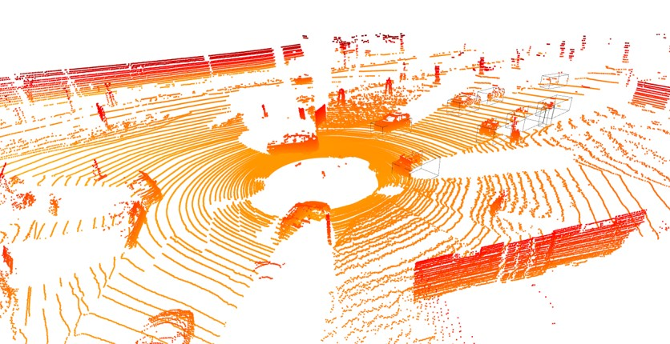

# 🚗 Transformer-Based 3D Object Detection in LiDAR Point Clouds
This repository presents a transformer-based deep learning architecture tailored for 3D object detection in LiDAR point clouds. Designed for autonomous vehicles navigating complex urban environments, our model integrates a pretrained PointNet++ feature extractor with a multi-headed self-attention transformer to achieve high detection accuracy, efficient spatial modeling, and scalability across sparse, large-scale input data.

## 🧠 Core Idea
Traditional methods like PointNet++ and CNNs struggle with long-range dependency modeling and real-time scalability for sparse, irregular LiDAR data. This project introduces:

* A transformer-based architecture for effective long-range spatial context.

* Pretrained PointNet++ embeddings for initial local feature extraction.

* Chunk-based LiDAR processing to support scalability.

* A custom loss function combining Smooth L1, IoU, and cross-entropy losses for accurate localization and classification.

## 🗂️ Key Features
Component | Description
|:---|:---|
Input | KITTI LiDAR point clouds ```(N, 3)```
Embedding | Pretrained PointNet++ → ```(N, 64)```
Transformer | 4 Transformer blocks × 4 attention heads
Output | Classification head (3 classes), Regression head (7D 3D bounding box)
Loss | Custom: ```α * L_reg + β * L_IoU + L_cls```
Evaluation | IoU, Classification Accuracy

## 🏗️ Network Architecture
## 📊 Overview
The following image illustrates the architecture of the Transformer-based 3D Object Detection Model used in this project:
<p align="center">
  
</p>

## 🔢 Loss Functions

### 📌 Classification Loss (Weighted Cross Entropy)

The classification loss is calculated using a weighted cross entropy formula to account for class imbalance:


**L<sub>classification</sub>** = − ∑ (w<sub>c</sub> × y<sub>c</sub> × log(ŷ<sub>c</sub>))

###  📏 Smooth L1 Regression Loss

Used for 3D bounding box regression, more robust to outliers than MSE:

**L<sub>regression</sub>** =  
    ⎧ 0.5 × (p − t)²      if |p − t| < 1  
    ⎨  
    ⎩ |p − t| − 0.5      otherwise

### 📦 Intersection over Union (IoU)

Measures the overlap between predicted and ground truth 3D bounding boxes.

**Intersection Volume**:  
Intersection = ∏ ( max(0, min(p<sub>d+3</sub>, t<sub>d+3</sub>) − max(p<sub>d</sub>, t<sub>d</sub>)) )  
               for d ∈ {1, 2, 3}

**Volume<sub>pred</sub>** = ∏ (p<sub>d+3</sub> − p<sub>d</sub>)  
**Volume<sub>true</sub>** = ∏ (t<sub>d+3</sub> − t<sub>d</sub>)

**IoU** = Intersection / (Volume<sub>pred</sub> + Volume<sub>true</sub> − Intersection + ε)

### 📉 IoU Loss

Encourages higher overlap between predicted and ground truth boxes:

**L<sub>IoU</sub>** = 1 − IoU

### ⚙️ Total Loss Function

The final loss is a weighted sum of classification, regression, and IoU losses:

**L<sub>total</sub>** = α × L<sub>regression</sub> + β × L<sub>IoU</sub> + L<sub>classification</sub>

Where:
- `α` and `β` are hyperparameters that control the contribution of each component.

## 🧪 Dataset
* Dataset: [KITTI 3D Object Detection Dataset](https://www.cvlibs.net/datasets/kitti/)

* Input: LiDAR ```.bin``` point clouds (x, y, z, intensity)

* Preprocessing:

  * Range filtering (max 80m radius)

  * Normalization to [0, 1]
 
  * Chunked loading (5,000 pts per chunk)
## 💡 Model Variants
Version | Key Features
:---|:---
Network1 | Vanilla Transformer w/o positional encoding
Network2 | Adds positional encoding
Network3 | Uses pretrained PointNet++ for embeddings
Network4 | Adds batch-wise chunking support
Network5 | Final model: Scalable, full loss, classification + regression heads

## 🏁 Training Details

Parameter | Value/Description
:---|:---
Batch size | 4–8 (depending on GPU memory)
Embedding dimensions | 64 (tested 128 for richer reps)
Attention heads | 4–8 per block
Transformer blocks | 2–6 blocks tested
Optimizer | Adam
LR Scheduler | Cosine Annealing with Warmup
Hardware | Lambda Labs Cloud (due to GPU demand)

## 📉 Training Insights
* Lower learning rates improved stability.

* Chunking allowed training on full scenes without memory overflow.

* Loss convergence was GPU-dependent. Deeper models showed better spatial learning but were resource-constrained.
## 📸 Sample Output
The following image illustrates the 3D objects detected
<p align="center">  </p>

## 🧠 Challenges Faced
* Floating-point instability in long-range points

* Lack of real-time GPU memory → chunking workaround

* Scaling transformer depth without overfitting

## 🚀 Future Work
* Incorporate RGB camera features for multi-modal fusion

* Experiment with BEV (Bird’s Eye View) fusion layers

* Explore Deformable Transformer or Voxel Transformer

* Use Waymo/OpenPCDet for transfer learning
